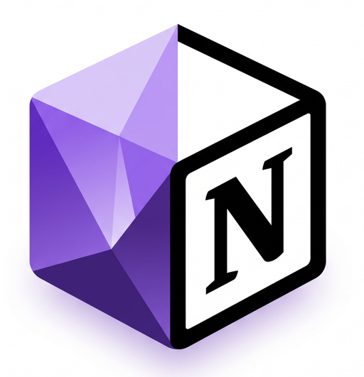
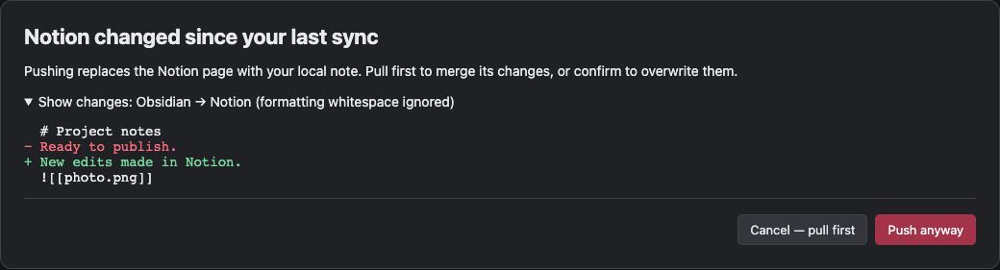
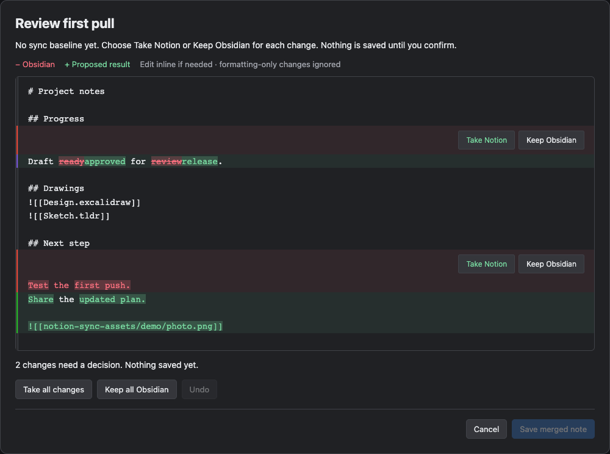

  

# Obsidian Notion Handoff

**Publish polished notes to your work or clients' Notion workspaces.**

Keep background research local. Share the notes you choose. You decide when to push and pull. Every sync is manual.

[Installation](#installation) · [Notion setup](#notion-setup)

## Base features

- **Push notes:** publish an Obsidian note to Notion, then push updates when you're ready.
- **Pull edits:** bring Notion changes back into Obsidian.
- **Open in Notion:** jump to the note's linked page from the command palette.
- **Upload images and files:** include attachments where they're embedded in your note. Pull new images into your chosen attachment folder.

## What makes it different

- **Workspaces for work and clients:** keep separate connections for each workspace. Every note remembers where it belongs.
- **Review changes:** merge independent edits and resolve conflicts one change at a time, with inline editing and Undo.
- **Editable drawings:** publish [Excalidraw](https://github.com/zsviczian/obsidian-excalidraw-plugin) and [TLDraw](https://github.com/tldraw/obsidian-plugin) embeds as PNG previews. Their source drawings stay editable in Obsidian. Enable the drawing's plugin to export it.

## See it in action

### Push with a diff

Run **Push to Notion** from the command palette. Review changed Notion content before replacing it. Pull first to merge those edits, or choose **Push anyway**.

### Review a pull

Run **Pull from Notion**. Independent edits merge automatically. For changes needing review, choose **Take Notion** or **Keep Obsidian**, edit inline, and use **Undo** as needed. **Save merged note** backs up your original and saves the result.

## Installation

Install the [latest GitHub release](https://github.com/cajames/obsidian-notion-handoff/releases/latest) through BRAT.

1. Install and enable [BRAT](https://github.com/TfTHacker/obsidian42-brat) through **Settings → Community plugins**.
2. In BRAT settings, choose **Add a beta plugin** and enter `cajames/obsidian-notion-handoff`.
3. Select the latest release, then enable **Notion Handoff**.

BRAT handles installation and updates. Desktop and experimental mobile support are enabled.

## Notion setup

1. [Create a Notion integration](https://www.notion.so/profile/integrations) with read, update, and insert content capabilities. Give it access to your target pages and a parent page for new notes.
2. In Notion Handoff settings, add a workspace name and **Notion access token**. Use an integration token or OAuth access token. Add a connection for each workspace you use.
3. Click **Test connection** to confirm the workspace, then **Choose parent page** to find the page for new notes by title.

Choose a workspace when prompted; your note saves the choice. A single workspace is selected automatically.

New pages use the note's `title` frontmatter property, or its filename. After creation, manage the page title in Notion.

### Browser sign-in (unreleased)

The source includes **Connect to Notion** for OAuth sign-in through `obsidian-notion-handoff.caj.ms`. The hosted service must be deployed before this works; the published **v0.1.0** release accepts existing tokens only. Users will not need to create their own integration once hosted sign-in is available.

[OAuth deployment guide](docs/oauth-deployment.md) · [Technical details](docs/notion-api.md)

## No warranty; limitation of liability

Notion Handoff and its hosted services are provided **“AS IS” and “AS AVAILABLE”**, without warranty of any kind, express or implied, including warranties of merchantability, fitness for a particular purpose, and non-infringement. Use them at your own risk. You are responsible for maintaining independent backups and reviewing changes before syncing.

**To the fullest extent permitted by applicable law**, the author, contributors, and service operators shall not be liable for any claims, damages, or other liability, including data loss, corruption, unintended disclosure, lost profits, or service interruption, whether in contract, tort, or otherwise, arising from the software or services, their use, or inability to use them, even if advised of the possibility of such damages. Nothing in this disclaimer excludes liability that cannot legally be excluded.
